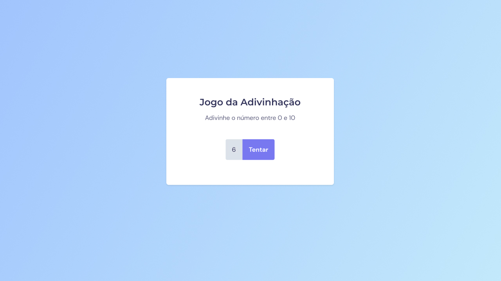

<h1 align="center"> Jogo de adivinhação </h1>

Repositório do desafio Jogo de adivinhação do stage 05 da turma 09 do explorer, o objetivo era criar uma página com um jogo de adivinhação.  

  <a href="#technologies">Technologies</a>&nbsp;&nbsp;&nbsp;|&nbsp;&nbsp;&nbsp;
  <a href="#project">Project</a>&nbsp;&nbsp;&nbsp;|&nbsp;&nbsp;&nbsp;
  <a href="#layout">Layout</a>

 

  

## 🚀 Technologies

Esse projeto foi desenvolvido com as seguintes tecnologias:

- HTML e CSS
- JavaScript
- Git e Github
- Figma

## 💻 Project

O projeto consiste em uma página onde o usuário tentará adivinhar um número entre 0 e 10 gerado randomicamente através do js.

- [Visite o projeto online](https://guessnumberexplorer-raulrodmo.netlify.app/)

## 🔖 Layout

Você pode visualizar o layout do projeto através [DESSE LINK](https://www.figma.com/file/5pZNHokTKTvld18xVAbk5C/Jogo-Adivinha%C3%A7%C3%A3o/duplicate). É necessário ter conta no [Figma](https://figma.com) para acessá-lo.

---

Made with 💜 by raulrodmo

